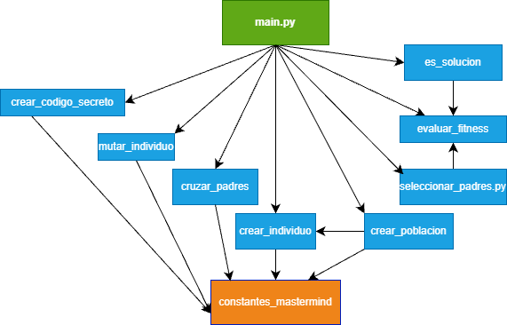

# mastermind_project
Juego Mastermind con Algoritmo Genético

Proyecto realizado por:
- [Dalila Teodosio](https://github.com/DalilaManu)
- [Yolanda Sobral](https://github.com/yolisobral)


___


# Tabla de contenidos


- [Introducción](#introducción)
- [Prerrequisitos](#prerrequisitos)
- [Instalación](#instalación)
- [Uso](#uso)
- [Metodología](#metodologia)
- [Descripción técnica](#descripción-técnica)
- [Requisitos funcionales/no funcionales](#requisitos-funcionalesno-funcionales)
- [Arquitectura de la aplicación](#arquitectura-de-la-aplicación)
- [Diagrama de Componentes](#diagrama-de-componentes)
- [Pruebas](#pruebas)
- [Tecnologías y herramientas utilizadas](#tecnologías-y-herramientas-utilizadas)
- [Backend](#backend)
- [Interfaz](#interfaz)
- [Análisis del tiempo invertido](#análisis-del-tiempo-invertido)
- [Justificación temporal](#justificación-temporal)
- [Uso de IA](#uso-de-ia)
- [Conclusiones](#conclusiones)
- [Posibles mejoras](#posibles-mejoras)
- [Dificultades](#dificultades)


## Introducción

Este proyecto es una implementación basica del juego Matermind usando un algorítmo genetico. Se ha desarrollado como práctica del aprendizaje de Python, algoritmos genéticos y control de versiones con Git y algoritmos evolutivos, con el objetivo de demostrar cómo un algoritmo genético puede evolucionar soluciones hasta resolver un código secreto generado aleatoriamente. 


**Objetivo del Juego**
- El objetivo es implementar un algoritmo genético capaz de resolver un código secreto generado aleatoriamente dentro de un número limitado de intentos.
- Mostrar en consola la evolución del fitness y el progreso del algoritmo.


# Instalación
- Para ejecutar el proyecto, primero se debe clonar el repositorio e instalar las dependencias en un entorno virtual:

1. Clonar el proyecto:
```bash
git clone <https://github.com/DalilaManu/mastermind_project.git> 
```

2. Entrar en la carpeta del proyecto:
```bash
cd mastermind_project 
```

3. Crear entorno virtual (linux):
```bash
python3 -m venv .venv
source .venv/bin/activate 
```

4. Instalar dependencias:
```bash
pip install -r requirements.txt
```


# Prerrequisitos
- Git para control de versiones.
- Es necesario contar con Python 3.13 o superior.
- Archivos importantes en el repositorio: ```.gitignore```, ```requirements.txt``` y ```__init__.py``` dentro de carpetas de módulos para que Python reconozca paquetes.


# Uso
**El juego se ejecuta desde la terminal utilizando:**
```bash
python main.py
```
- El programa generará un código secreto y aplicará un algoritmo genético para encontrarlo en un máximo de intentos. Se mostrará en consola la evolución del fitness y si la solución fue encontrada o no.
- Ejemplo de salida en consola:
```bash
Código secreto generado: ['🟠', '🟡', '🟣', '🟢'] ¡Comienza el juego!

Intento 1:
individuo: 🟠 🟡 🟣 🔴 | Fitness: 3

Intento 2:
individuo: 🟠 🟡 🟣 🔴 | Fitness: 3

Intento 3:
individuo: 🟠 🟡 🟣 🔵 | Fitness: 3

Intento 4:
individuo: 🟠 🟡 🟣 🟢 | Fitness: 4

¡Has encontrado el código secreto en: 4 intentos.
Mejor individuo: 🟠 🟡 🟣 🟢 | Fitness: 4
```


# Metodologia
- Se utilizó un enfoque básico de algoritmo genético:

1. Crear poblácion inicial de indivíduos aleatórios.
2. Evaluar fitness de cada indivíduo (número de colores correctos en posición correcta).
3. Seleccionar los individuos con mejor fitness como padres. Se aplicó un elitismo parcial en esta selección para asegurar que los mejores individuos influyeran en la nueva población.
4. Cruzar y mutar para generar nueva población.
5. Repetir hasta encontrar la solución o alcanzar el límite de intentos.
- No se utilizaron frameworks externos para la lógica del juego; todo se implementó en Python estándar.

# Descripción Técnica 
El proyecto se encuentra en un algoritmo genético simple:
* GENES = 4
* VALORES_POSIBLES = ['AMARILLO', 'AZUL', 'ROJO', 'VERDE', 'NARANJA', 'MORADO']
* POBLACION = 50
* TASA_MUTACION = 0.01
* MAX_INTENTOS = 15
* EMOJIS = {
    'AMARILLO': '🟡',
    'AZUL': '🔵',
    'ROJO': '🔴',
    'VERDE': '🟢',
    'NARANJA': '🟠',
    'MORADO': '🟣'
}

# Requisitos funcionales/no funcionales 
El sistema debe ser capaz de generar un código secreto aleatório y aplicar un algoritmo genético para resolverlo automáticamente, mostrar en consola cada intento realizado por la población hasta encontrar la solución o alcanzar el límite de intentos. 
Entre los requisitos no funcionales se incluyen:
* Modularización completa del código
* Salida en consola clara y legible
* Cobertura de tests unitários: cada módulo cuenta con tests que aseguran que su funcionamiento es correto.
* Uso exclusivo de Python estándar

# Arquitectura de la aplicación

La aplicación sigue una arquitectura modular inspirada en el patrón MVC (Modelo–Vista–Controlador), adaptado a un entorno sin interfaz gráfica.

- **Controlador (Controller)**  
  `main.py` controla el flujo del programa, coordina la ejecución del algoritmo genético y gestiona la interacción por consola.

- **Modelo (Model)**  
  La lógica del algoritmo genético está distribuida en varios módulos independientes dentro del directorio `src/`, cada uno con una responsabilidad específica:
  
  - `crear_codigo_secreto.py`
  - `crear_individuo.py`
  - `crear_poblacion.py`
  - `evaluar_fitness.py`
  - `seleccionar_padres.py`
  - `cruzar_padres.py`
  - `mutar_individuo.py`
  - `es_solucion.py`

- **Configuración**  
  `constantes_mastermind.py` centraliza todos los parámetros del juego y del algoritmo (genes, colores, tasa de mutación, etc.).

- **Vista (View)**  
  No existe una vista gráfica. La visualización se realiza por consola con `main.py`.


# Diagrama de Componentes

<p aling="center">
  
</p>

`main.py` controla el flujo del juego y coordina la ejecución de los módulos del algoritmo genético.

Los módulos del directorio `src/` implementan la lógica del algoritmo genético de forma modular e independiente.

`constantes_mastermind.py` define los parámetros del juego (colores, genes, tasa de mutación, etc.) y es utilizado por los módulos del modelo.

# Pruebas
Cada módulo del algoritmo genético está cubierto por tests unitarios.
Los tests se ejecutan desde la consola, utilizando exclusivamente Pytest, sin frameworks adicionales.
* Ejecución de tests en consola muestra:
```bash
collected 9 items                                                                                                                                                                                                         

test\test_crear_codigo_secreto.py .                                                                                                                                                                                 [ 11%]
test\test_crear_individuo.py .                                                                                                                                                                                      [ 22%]
test\test_crear_poblacion.py .                                                                                                                                                                                      [ 33%]
test\test_cruzar_padres.py .                                                                                                                                                                                        [ 44%]
test\test_es_solucion.py ..                                                                                                                                                                                         [ 66%]
test\test_evaluar_fitness.py .                                                                                                                                                                                      [ 77%]
test\test_mutar_individuo.py .                                                                                                                                                                                      [ 88%]
test\test_seleccionar_padres.py .                                                                                                                                                                                   [100%]

=================================================================================================== 9 passed in 0.05s ====================================================================================================
```


# Tecnologías y herramientas utilizadas
* Python 3.13.9
* Pytest para tests unitarios 
* Gitpara control de versiones 
* Markdown para documentación
* Editor: VS Code 
* Referencias: Grokking Artificial Intelligence Algorithms 


# Backend
* Lógica del juego está completamente implementada en Python

# Interfaz
* Consola de comandos (terminal). No se utiliza Interfaz gráfica ni web.


# Análisis del tiempo invertido

Para el seguimiento del tiempo dedicado al proyecto se utilizó **WakaTime**, una herramienta de medición automática de actividad en el editor de código.

<p aling="center">
  
</p>

Según los datos globales del proyecto registrados por WakaTime, el tiempo total invertido fue de aproximadamente **27 horas**.

La información visual presentada corresponde a la actividad registrada **durante los últimos 7 días**, período en el cual se reflejan las sesiones finales de desarrollo y documentación del proyecto. 

En ese período reciente, el tiempo se distribuyó principalmente en:

- **Markdown:** redacción y ajustes de la documentación del proyecto.
- **Python:** desarrollo y refinamiento de la lógica del algoritmo genético y pruebas.
- **Editor utilizado:** Visual Studio Code.


# Justificación Temporal
Algunas tareas requirieron más tiempo debido a la complejidad de entender la evolución de la población y la correcta modularización del código. Además, al ser principiante en programación de algoritmos genéticos y tests unitarios, el proceso de implementación resultó más desafiante, ya que fue necesario aprender conceptos y aplicarlos correctamente.

# Uso de IA 

Durante la implementación de los tests unitarios se utilizó GitHub Copilot. Copilot ayudó a generar sugerencias de código para los tests, agilizando su creación.
Tambiém se utilizó Copilot y ChatGPT como guía y sugerencia puntual para recordar sintaxis de Python y estructuras básicas.


# Conclusión
 El proyecto permitió aprender a implementar un algoritmo genético aplicado al juego Mastermind, modularizando el código y verificando su correcto funcionamiento mediante tests unitarios. El proceso también reforzó la importancia de la planificación y de la comprensión de cada módulo antes de integrarlos, especialmente como principiante en programación de algoritmos genéticos.

La ejecución en consola permite visualizar cómo la población de individuos evoluciona hasta encontrar la solución, y la experiencia adquirida durante el desarrollo, incluyendo la resolución de dificultades iniciales, contribuyó significativamente al aprendizaje.

# Posibles Mejoras 

* Mejorar la diversidad genética de la población  
* Añadir interfaz gráfica o web para visualización del juego.
* Evitar estancamiento evolutivo (el fitness no mejora durante vários intentos)


# Dificultades 

* Comprender la lógica del algoritmo genético como principiante.

* Manejo de importaciones relativas y modularización en Python.

* Implementación y comprensión de tests unitarios.


A pesar de las dificultades, este proyecto permitió consolidar conocimientos de Python, algoritmos genéticos y pruebas unitarias, preparando el camino para futuros proyectos más complejos. 


