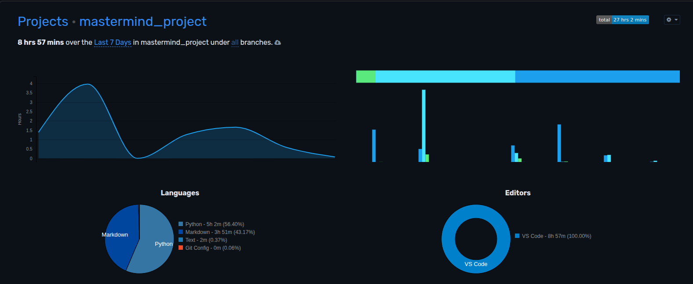

# mastermind_project
Juego Mastermind con Algoritmo Genético

___


# Tabla de contenidos


- [Introducción](#introducción)
- [Manual](#manual)
- [Prerrequisitos](#prerrequisitos)
- [Instalación](#instalación)
- [Uso](#uso)
- [Metodología](#metodologia)
- [Descripción técnica](#descripción-técnica)
- [Requisitos funcionales/no funcionales](#requisitos-funcionalesno-funcionales)
- [Historias de usuaria](#historias-de-usuaria)
- [Arquitectura de la aplicación](#arquitectura-de-la-aplicación)
- [Diseño](#diseño)
- [Diagrama de Componentes](#diagrama-de-componentes)
- [Implementación](#implementación)
- [Tecnologías y herramientas utilizadas](#tecnologías-y-herramientas-utilizadas)
- [Backend](#backend)
- [Interfaz](#interfaz)
- [Pruebas](#pruebas)
- [Test de unidad](#test-de-unidad)
- [Test de integración](#test-de-integración)
- [Análisis del tiempo invertido](#análisis-del-tiempo-invertido)
- [Justificación temporal](#justificación-temporal)
- [Uso de IA](#uso-de-ia)
- [Conclusiones](#conclusiones)
- [Posibles mejoras](#posibles-mejoras)
- [Dificultades](#dificultades)


## Introducción

Este proyecto es una implementación basica del juego Matermind usando un algorítmo genetico. Se ha desarrollado como práctica del aprendizaje de Python, algoritmos genéticos y control de versiones con Git y algoritmos evolutivos, con el objetivo de demostrar cómo un algoritmo genético puede evolucionar soluciones hasta resolver un código secreto generado aleatoriamente. El proyecto permite visualizar en consola la evolución de la población de individuos y cómo se aproxima a la solución óptima.


**Objetivo del Juego**
- El objetivo es implementar un algoritmo genético capaz de “resolver” o encontrar un código secreto generado aleatoriamente dentro de un número limitado de intentos, mostrando cómo evolucionan las poblaciones de individuos.

# Manual

**Instalación**
- Para ejecutar el proyecto, primero se debe clonar el repositorio e instalar las dependencias en un entorno virtual:

1. Clonar el proyecto:
```bash
git clone <https://github.com/DalilaManu/mastermind_project.git> 
```

2. Entrar en la carpeta del proyecto:
```bash
cd mastermind_project 
```

3. Crear entorno virtual (linux):
```bash
python3 -m venv .venv
source .venv/bin/activate 
```

4. Instalar dependencias:
```bash
pip install -r requirements.txt
```

# Prerrequisitos
- Es necesario contar con Python 3.13 o superior.
- Conocimientos básicos de terminal y entorno virtual.  
- Git para control de versiones.
- Archivos importantes en el repositorio: ```.gitignore```, ```requirements.txt``` y ```__init__.py``` dentro de carpetas de módulos para que Python reconozca paquetes.

# Instalación
- La instalación se realiza a través de pip mediante el archivo requirements.txt, que incluye todas las dependencias necesarias para ejecutar los tests y el juego.


# Uso
**El juego se ejecuta desde la terminal utilizando:**
```bash
python main.py
```
- El programa generará un código secreto y aplicará un algoritmo genético para encontrarlo en un máximo de intentos. Se mostrará en consola cada intento y si la solución fue encontrada o no.
- Ejemplo de salida en consola:
```bash
Código secreto generado: ['🟡', '🟠', '🟡', '🟣'] ¡Comienza el juego!

Intento 1:

Intento 2:

Intento 3:

Intento 4:
Melhor intento: 🟡 🟠 🟡 🟣 | Fitness: 4
```


# Metodologia
- Se utilizó un enfoque básico de algoritmo genético:

1. Crear poblácion inicial de indivíduos aleatórios.
2. Evaluar fitness de cada indivíduo (número de colores correctos en posición correcta).
3. Seleccionar los individuos con mejor fitness como padres.
4. Cruzar y mutar para generar nueva población.
5. Repetir hasta encontrar la solución o alcanzar el límite de intentos.
- No se utilizaron frameworks externos para la lógica del juego; todo se implementó en Python estándar.

# Descripción Técnica 
El proyecto se encuentra en un algoritmo genético simple:
* GENES = 4
* VALORES_POSIBLES = ['AMARILLO', 'AZUL', 'ROJO', 'VERDE', 'NARANJA', 'MORADO']
* POBLACION = 50
* TASA_MUTACION = 0.01
* MAX_INTENTOS = 15
* EMOJIS = {
    'AMARILLO': '🟡',
    'AZUL': '🔵',
    'ROJO': '🔴',
    'VERDE': '🟢',
    'NARANJA': '🟠',
    'MORADO': '🟣'
}

# Requisitos funcionales/no funcionales 
El sistema debe ser capaz de generar un código secreto y aplicar un algoritmo genético para resolverlo automáticamente, mostrando la evolución de la población en consola. Los usuarios pueden configurar parámetros del algoritmo, como población, genes, tasa de mutación y número máximo de intentos.
Entre los requisitos no funcionales se incluyen la modularización del código para facilitar su mantenimiento, la claridad de la salida en consola y la posibilidad de añadir pruebas unitarias sin afectar la lógica central del juego.

# Arquitectura de la aplicación 
* Separación entre constantes (```constantes_mastermind```) y lógica (```genetico.py``` y ```main.py```).


- Patrón similar a MVC: main.py actúa como controlador, genetico.py como modelo, constantes_mastermind.py como fuente de configuración.
- Comunicación entre módulos mediante parámetros y retornos, evitando dependencias circulares. Esto garantiza cohesión y facilita futuras mejoras.

# Diseño 
# Diagrama de Componentes
```
           _________________
          |  main.py       |
          |  (Controlador) |
          __________________
                   |
                   |
           ________________
          | genetico.py    |
          |  (Modelo)      |
          __________________
           ^           ^
           |           |
__________________   _________________
| constantes_    |     | tests/     |
| mastermind.py  |     | (Validación)|
| (Configuración)|     _________________
__________________


```
``` main.py``` controla el flujo del juego y coordina la ejecución de las funciones del algoritmo genético.

```genetico.py``` contiene la lógica principal: creación de población, evaluación de fitness, selección de padres, cruce y mutación.

```constantes_mastermind.py``` define los parámetros del juego (colores, genes, tasa de mutación, etc.) y es utilizado por genetico.py.

```tests/``` contiene pruebas unitarias que verifican la correcta ejecución de cada función del modelo, asegurando la robustez del código.

Las flechas indican el flujo de datos y dependencias: main.py llama al modelo, que depende de la configuración; los tests verifican el comportamiento del modelo de manera independiente.

* Ejecución de tests en consola muestra:
```bash
collected 8 items                                                                                                                                                                                        

test\test_crear_codigo_secreto.py .                                                                                                                                                                [ 12%]
test\test_crear_individuo.py .                                                                                                                                                         [ 25%]
test\test_cruzar_padres.py .                                                                                                                                                                       [ 37%]     
test\test_es_solucion.py ..                                                                                                                                                                        [ 62%]     
test\test_evaluar_fitness.py .                                                                                                                                                                     [ 75%]     
test\test_mutar_individuo.py .                                                                                                                                                                     [ 87%]     
test\test_seleccionar_padres.py .                                                                                                                                                                  [100%]     

=========================================================================================== 8 passed in 0.04s ===========================================================================================   

```


# Implementación 
# Tecnologías y herramientas utilizadas
* Python 3.13.9
* Pytest para tests unitarios 
* Gitpara control de versiones 
* Markdown para documentación
* Editor: VS Code 
* Referencias: Grokking Artificial Intelligence Algorithms 


# Backend
* Lógica del juego está completamente implementada en Python

# Interfaz
* Consola de comandos (terminal). No se utiliza Interfaz gráfica ni web.
# Pruebas


Todos los módulos críticos están cubiertos por pruebas unitarias: creación de individuos, evaluación de fitness, selección de padres, cruce y mutación.

# Test de unidad
* Cada función se prueba individualmente, comprobando que genera resultados correctos.

# Test de integración
* Se realizaron pruebas de integración que comprueban que los módulos trabajan correctamente en conjunto, desde la generación de población hasta la resolución del código secreto.


# Análisis del tiempo invertido

Para el seguimiento del tiempo dedicado al proyecto se utilizó **WakaTime**, una herramienta de medición automática de actividad en el editor de código.

<p align="center">
  
</p>

Según los datos globales del proyecto registrados por WakaTime, el tiempo total invertido fue de aproximadamente **27 horas**.

La información visual presentada corresponde a la actividad registrada **durante los últimos 7 días**, período en el cual se reflejan las sesiones finales de desarrollo y documentación del proyecto. 

En ese período reciente, el tiempo se distribuyó principalmente en:

- **Markdown:** redacción y ajustes de la documentación del proyecto.
- **Python:** desarrollo y refinamiento de la lógica del algoritmo genético y pruebas.
- **Editor utilizado:** Visual Studio Code.


# Justificación Temporal
Algunas tareas requirieron más tiempo debido a la complejidad de entender la evolución de la población y la correcta modularización del código. Además, al ser principiante en programación de algoritmos genéticos y tests unitarios, el proceso de implementación resultó más desafiante, ya que fue necesario aprender conceptos y aplicarlos correctamente sin ayuda externa.

# Uso de IA 

Durante la implementación de los tests unitarios se utilizó GitHub Copilot como asistente de programación. Copilot ayudó a generar sugerencias de código para los tests, agilizando su creación.
Se utilizó únicamente como guía y sugerencia.


# Conclusión
 El proyecto permitió aprender a implementar un algoritmo genético aplicado al juego Mastermind, modularizando el código y verificando su correcto funcionamiento mediante tests unitarios. El proceso también reforzó la importancia de la planificación y de la comprensión de cada módulo antes de integrarlos, especialmente como principiante en programación de algoritmos genéticos.

La ejecución en consola permite visualizar cómo la población de individuos evoluciona hasta encontrar la solución, y la experiencia adquirida durante el desarrollo, incluyendo la resolución de dificultades iniciales, contribuyó significativamente al aprendizaje y a la adquisición de habilidades en desarrollo de software modular y testeable.

# Posibles Mejoras 
* Añadir interfaz gráfica o web para visualización del juego.
* Mostrar evolución de la población en cada intento con detalle de fitness.


# Dificultades 

* Comprender la lógica del algoritmo genético como principiante.

* Manejo de importaciones relativas y modularización en Python.

* Implementación y comprensión de tests unitarios.


A pesar de las dificultades, este proyecto permitió consolidar conocimientos de Python, algoritmos genéticos y pruebas unitarias, preparando el camino para futuros proyectos más complejos. 


